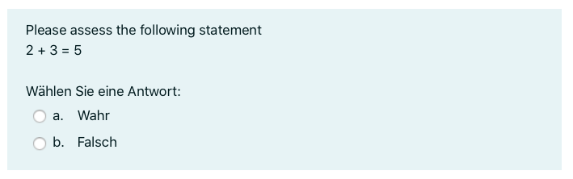
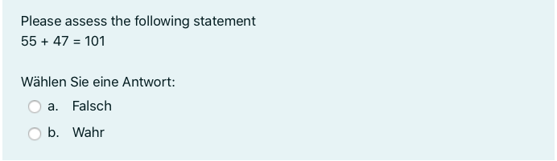
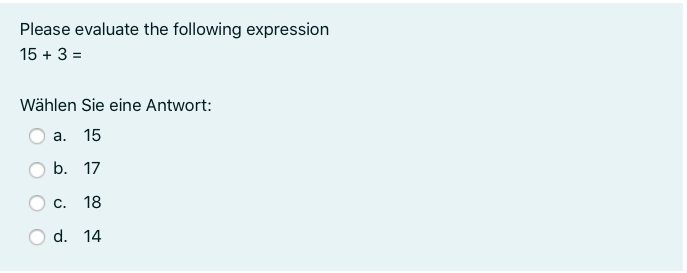
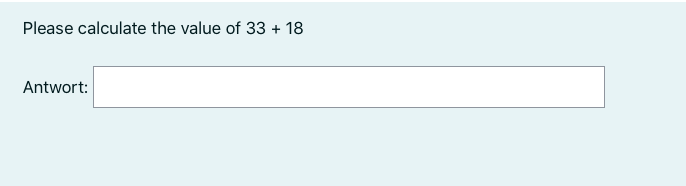
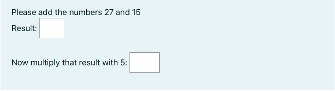
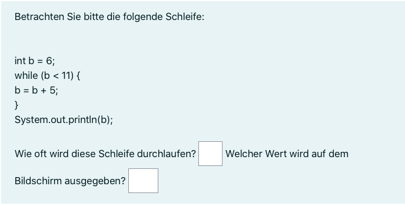
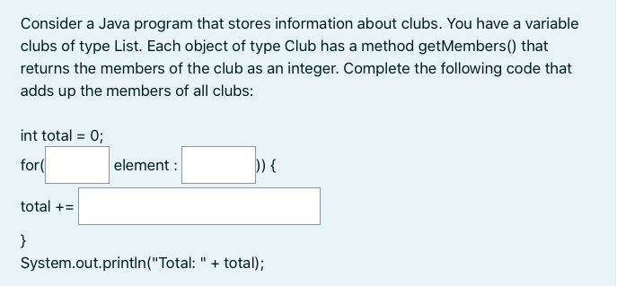
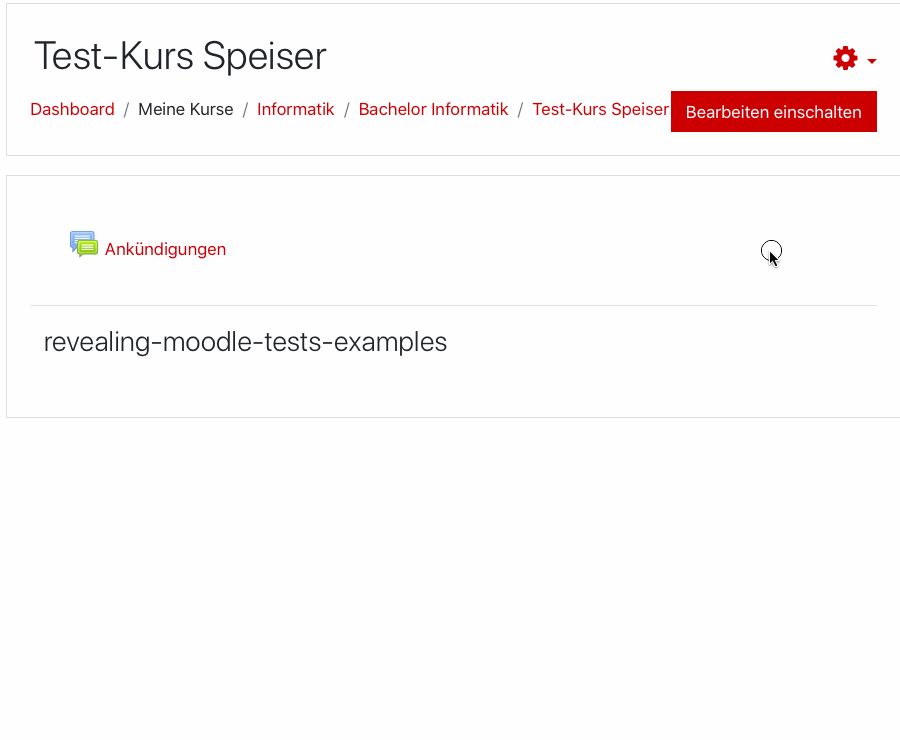
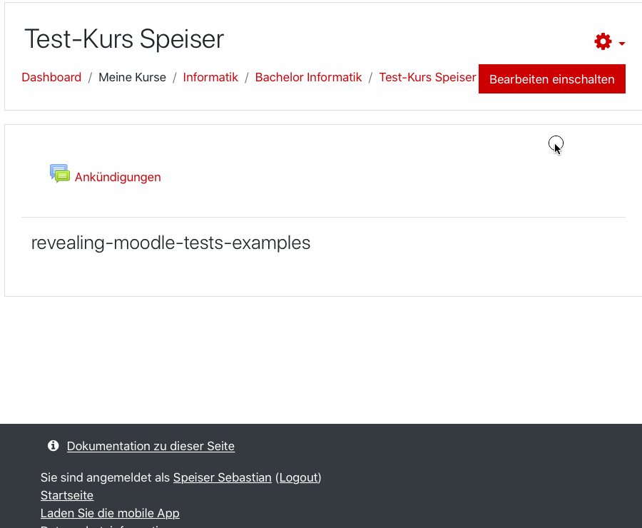
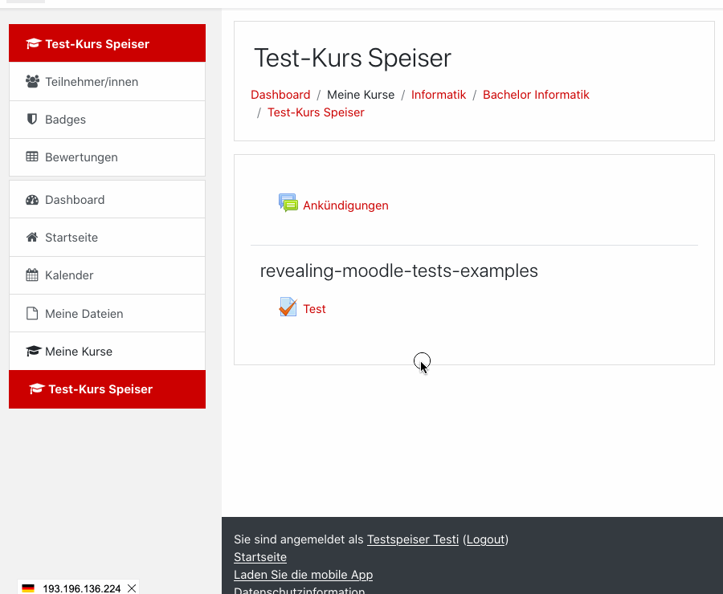

# Revealing Moodle Tests - every student gets a different question <!-- omit in toc -->

Programmatically create Moodle test questions. You specify how to generate questions for a category and the library generates corresponding XML files that can be imported into Moodle. When creating a Moodle test, you can then select the number of questions that should be randomly selected of each category for each student.

 Table of contents:
- [Install](#install)
- [Usage](#usage)
- [Methods for generating questions](#methods-for-generating-questions)
  - [addMultiChoice](#addmultichoice)
  - [addQuestions](#addquestions)
- [Examples](#examples)
  - [Simple Yes-No-Questions](#simple-yes-no-questions)
  - [Programmatically generated Yes-No-Questions](#programmatically-generated-yes-no-questions)
  - [Multiple Choice](#multiple-choice)
  - [Free text answers](#free-text-answers)
  - [Cloze / complex questions](#cloze--complex-questions)
  - [Java Example 1: understand code exercise](#java-example-1-understand-code-exercise)
  - [Java Example 2: Same exercise different domains](#java-example-2-same-exercise-different-domains)
- [How to use it in Moodle](#how-to-use-it-in-moodle)
  - [Import categories and questions into Moodle course](#import-categories-and-questions-into-moodle-course)
  - [Create a Moodle test with random questions from category](#create-a-moodle-test-with-random-questions-from-category)
  - [Perform Moodle test](#perform-moodle-test)

## Install

You can get revealing-moodle-tests via npm.
```
$ npm i revealing-moodle-tests --save
```

A template project with an initialized TypeScript structure, imported dependencies and code for the example questions shown below can be found at [sspeiser/revealing-moodle-tests-examples](https://github.com/sspeiser/revealing-moodle-tests-examples)

## Usage

```TypeScript
import { RevealingMoodleTests } from 'revealing-moodle-tests';

const tests = new RevealingMoodleTests();

// Add questions, see below for more advanced examples
tests.addMultiChoice('Arithmetic statements simple', 'Please assess the following statement', {
    '2 + 3 = 5': true,
    '3 + 7 = 8': false,
    '1 + 1 = 3': false,
    '1 + 1 = 2': true
});

tests.saveTo("examples.xml")
```

## Methods for generating questions

There are currently two methods that can be used on the RevealingMoodleTests object to add questions. See below for examples.

### addMultiChoice
```TypeScript
addMultiChoice(name: string,
               text: string,
               statements: Record<string, boolean | string[]>): void 
```
Create a category `name` with one multiple choice question for each entry in statements. Each question has the question text: `text`, blank line, key of the statement.

There are either:
- Two answer options if the value of the statement is of type `boolean`. The specified boolean value is considered as correct answer, the negation as false.
- One answer option for each element if the value of the statement is of type `string[]`. Mark correct answers by putting an equal sign in front of the answer string (just as in Moodle, e.g. `"=Correct answer"`)

### addQuestions
```TypeScript
addQuestions(name: string, 
             n: number, 
             qtype: "cloze" | "shortanswer", 
             genQuestion: () => { name?: string, text: string, answers?: string[] }): void
```
Create a category `name` and call `n` times the function `genQuestion` which should return a question corresponding to `qtype`.

In case of `qtype === "cloze"` only the text has to specified in cloze format which already contains all answers.

In case of `qtype === "shortanswer"`, specify the correct (and incorrect) answers.

## Examples

### Simple Yes-No-Questions

Simple Yes-No-Questions that are put in the same category
Of course this can be done in Moodle directly but if you prefer typing
over lots of mouse clicking in Moodle this is the way to go

Please note the singular statement in the question text as for each
entry a new question is generated

```TypeScript
tests.addMultiChoice('Arithmetic statements simple', 'Please assess the following statement', {
    '2 + 3 = 5': true,
    '3 + 7 = 8': false,
    '1 + 1 = 3': false,
    '1 + 1 = 2': true
});
```

Generates 4 questions like the following:


### Programmatically generated Yes-No-Questions

Better to generate the statements programatically
Also we can use some helper functions for generating random values
 
```TypeScript
const stmts_yesno: Record<string, boolean> = {}
for (let index = 0; index < 50; index++) {
    const a = RevealingMoodleTests.randomInt(1, 100);
    const b = RevealingMoodleTests.randomInt(1, 100);
    const c = a + b + RevealingMoodleTests.randomInt(-1, 1);
    stmts_yesno[`${a} + ${b} = ${c}`] = a + c == c;
}

tests.addMultiChoice('Arithmetic statements generated',
    'Please assess the following statement',
    stmts_yesno);
```

Generates 50 questions like the following example:


### Multiple Choice

If Yes-No is too simple, then we can also have more answer options
Shuffle Answers is true by default so Moodle will randomly arrange
the answer options

```TypeScript
const stmts_multi: Record<string, string[]> = {}
for (let index = 0; index < 50; index++) {
    const a = RevealingMoodleTests.randomInt(1, 100);
    const b = RevealingMoodleTests.randomInt(1, 100);
    const c = a + b;
    const errors = [0];
    for (let j = 0; j < 3; j++) {
        errors.push(RevealingMoodleTests.randomInt(1, 3) * -1 ^ (RevealingMoodleTests.randomInt(0, 1)));
    }
    stmts_multi[`${a} + ${b} = `] = errors.map((error) => {
        if (error == 0) {
            return '=' + c.toString();
        } else {
            return (c + error).toString();
        }
    });
}
tests.addMultiChoice('Arithmetic calculations multi',
    'Please evaluate the following expression',
    stmts_multi)
```

Generates 50 questions like the following example:


### Free text answers

That is still too simple, let's do free text answers

```TypeScript
tests.addQuestions('Arithmetic calculations free text',
    50,
    'shortanswer',
    () => {
        const a = RevealingMoodleTests.randomInt(1, 100);
        const b = RevealingMoodleTests.randomInt(1, 100);
        const c = a + b;
        return {
            text: `Please calculate the value of ${a} + ${b}`,
            answers: [c.toString()]
        }
    })
```

Generates 50 questions like the following example:



### Cloze / complex questions

Finally, we can create cloze questions with multiple subquestions
of different types

```TypeScript
tests.addQuestions('Arithmetic calculations cloze',
    50,
    'cloze',
    () => {
        const a = RevealingMoodleTests.randomInt(1, 100);
        const b = RevealingMoodleTests.randomInt(1, 100);
        const c = a + b;
        const factor = RevealingMoodleTests.randomInt(2, 5);
        const d = c * factor;

        return {
            text: `Please add the numbers ${a} and ${b}
            Result: {1:SHORTANSWER:=${a + b}}
            
            Now multiply that result with ${factor}: {1:SHORTANSWER:=${d}}`
        }

    })
```

Generates 50 questions like the following example:


### Java Example 1: understand code exercise

Of course we can also create questions about much more complex domains
Java Loops, sorry in German

```TypeScript
tests.addQuestions('Java while loops', 20, "cloze", () => {
    const varname = RevealingMoodleTests.randomChar();
    const initval = RevealingMoodleTests.randomInt(2, 9);
    const maxval = RevealingMoodleTests.randomInt(11, 33);
    const incr = RevealingMoodleTests.randomInt(3, 6);
    let i = initval;
    let reps = 0;
    while (i < maxval) {
        reps += 1;
        i = i + incr;
    }
    const finalval = i;

    return {
        text: `Betrachten Sie bitte die folgende Schleife:<br />
    
     int ${varname} = ${initval};
     while (${varname} < ${maxval}) {
         ${varname} = ${varname} + ${incr};
        }
        System.out.println(${varname});
     
    Wie oft wird diese Schleife durchlaufen? {1:SHORTANSWER:=${reps}} Welcher Wert wird auf dem Bildschirm ausgegeben? {1:SHORTANSWER:=${finalval}}`
    }
})
```

Generates 20 questions like the following example:


### Java Example 2: Same exercise different domains

Or maybe the code for the exercise is quite the same but we want
to vary domains

```TypeScript
tests.addQuestions('Java for each loops', 20, "cloze", () => {
    const domain = RevealingMoodleTests.randomElement([
        {
            'object': 'Book', 'collection': 'books',
            'numericValue': 'pages', 'numericFunction': 'getPages()'
        },
        {
            'object': 'Conference', 'collection': 'conferences',
            'numericValue': 'participants', 'numericFunction': 'getParticipants()'
        },
        {
            'object': 'Club', 'collection': 'clubs',
            'numericValue': 'members', 'numericFunction': 'getMembers()'
        }
    ]);

    return {
        text: `Consider a Java program that stores information about \
${domain['collection']}. You have a variable ${domain['collection']} \
of type List<${domain['object']}>. Each object of type ${domain['object']} \
has a method ${domain['numericFunction']} that returns the ${domain['numericValue']} \
of the ${domain['object'].toLowerCase()} as an integer. \
Complete the following code that adds up the ${domain['numericValue']} of \
all ${domain['collection']}:

int total = 0;
for({1:SHORTANSWER:=${domain['object']}} element : {1:SHORTANSWER:=${domain['collection']}})) {
    total += {1:SHORTANSWER:=element.${domain['numericFunction']};}
}
System.out.println("Total: " + total);`}
})
```
Generates 20 questions like the following example (there are less than 20 possibilities but any way):



## How to use it in Moodle

### Import categories and questions into Moodle course


### Create a Moodle test with random questions from category


### Perform Moodle test
